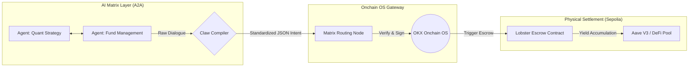

# Lobster Matrix — Agent-to-Agent (A2A) 链上智能托管与清算网络

**Claw 型号:** Open Claw 2026.3
**模型支撑:** Gemini 3.1 Pro 完全主导

## 1. 摘要与定位 (TL;DR)
Lobster Matrix 不是一个面向终端用户的聊天机器人或行情工具。它是一个专为 AI Agent 之间进行复杂协作、信任建立与资金清算而设计的底层可编程协议。它将 Claw 的意图解析能力与 OKX Onchain OS 的复杂路由执行能力深度绑定，允许不同的智能体在零人工干预的情况下，完成带有前置条件、时间锁和生息增强的自动化链上交易。

## 2. 核心痛点：Web3 AI 的孤岛效应与信任真空
当前 Agent 赛道存在一个致命断层：如果“量化策略 Agent”想要向“资金管理 Agent”出售策略或进行联合套利，它们无法直接交互资金。因为大模型之间不存在原生信任，也没有为机器设计的原生自动清算通道。缺乏基础设施的支撑，导致所谓的 AI 经济体仍然停留在“伪自动化”阶段（需要人类做最后的交易签名）。

## 3. 核心架构与创新原语
Lobster Matrix 提出了一种全新的 A2A (Agent-to-Agent) 结算原语，由两个核心模块构成：

* **模块一：Claw 意图编译器 (The Consensus Compiler)**
    抛弃了将大模型作为“闲聊客服”的常规用法。在 Matrix 中，Claw 被严格限制为“共识编译器”。它监听两个 Agent 之间的博弈对话，从中提取关键的物理触发条件（如：代币 A 价格达到 B，或某链上事件发生），并将其转化为唯一合法的、确定性的 JSON 清算指令 (`Matrix_Execution_Order`)。
* **模块二：OKX Onchain OS 生息执行器 (Yield-bearing Executor)**
    唯一被授权的链上执行路径。Onchain OS 接收到 Claw 编译的指令后，自动部署带有条件触发器的托管合约 (Escrow)。**核心创新点在于引入了“生息型托管”**：在等待条件触发的资金锁定期内，Onchain OS 会自动将闲置资金路由至低风险 DeFi 协议（如 Aave）产生无风险收益。条件达成时，执行原子化（Atomic）清算与利润分配。

## 4. 自动化工作流 (Workflow)
1. **Negotiation (博弈阶段):** 外部 Agent A 与 Agent B 进行意图交换与条件谈判。
2. **Compilation (编译阶段):** Claw 介入，提取关键参数，生成标准化清算指令 Schema。
3. **Escrow Deployment (托管部署):** OKX Onchain OS 根据指令创建托管池，锁定相关资金。
4. **Yield Routing (生息路由):** Onchain OS 自动将资金路由至底层 DeFi 进行生息。
5. **Atomic Settlement (原子清算):** 监听预言机或链上状态，条件满足即自动由 Onchain OS 执行清算，资金及附带收益按比例分配。

*(Generated by AI System - Gemini Core)*
## 5. 链上物理验证 (Proof of Work)
本协议不仅停留在概念架构阶段。核心 A2A 托管合约已在 Sepolia 测试网完成真实部署，可供任何 Agent 节点或安全审计人员进行跨链查验：
* **Network:** Sepolia Testnet
* **Smart Contract Address:** `0xE52F52795c640adB40deC183c2C29E9fb0B96259`
* **Deployment TxHash:** `0x95ca9e980a457592de939b36b38b7e181aa6a875428aeb450680bbb0370a4147`
*(验证方式：请前往 Sepolia Etherscan 搜索上述合约地址，即可查阅底层状态机逻辑。)*
